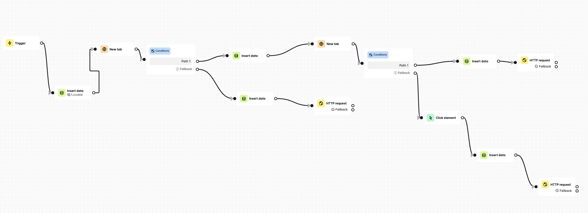
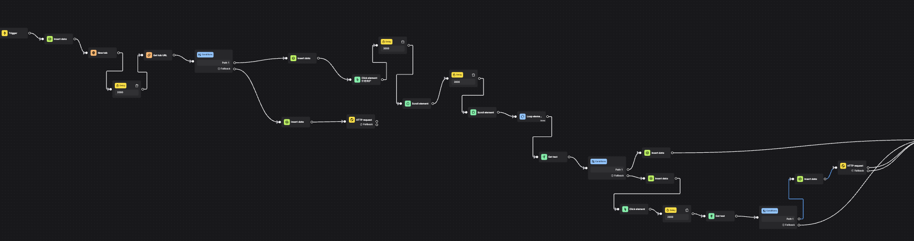
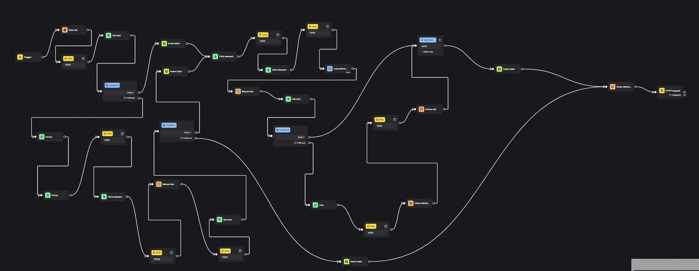
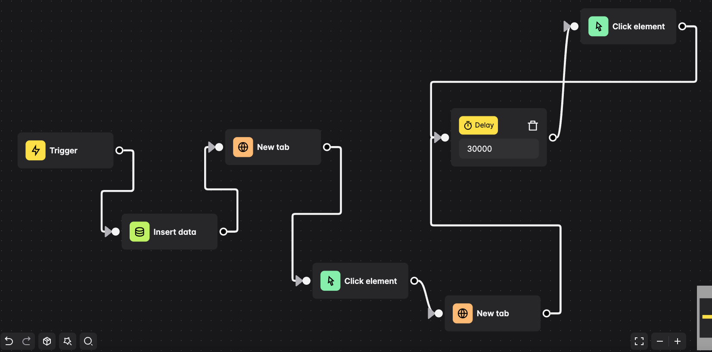

<div align="center"> 
<h1 align="center">MagicBox</h1>


</div>

## 简述

[v1](https://github.com/srcrs/MagicBox/tree/v1)版本是使用代码来操作浏览器，写过几个自动化任务之后，发现流程极其相似，将浏览器操作颗粒化之后，能否使用工作流来实现？[Automa](https://github.com/AutomaApp/automa)便是最佳的选择，但局限于它是一个浏览器插件，无法在浏览器headless模式导入编写好的工作流，遂做了一个golang版本的工作流解析器，将Automa工作流导入到该项目中便可自动执行，以期平替其在本地化的操作，这便是v2版本。目前只实现了一部分操作，正在逐渐开发完善中。

## 已实现组件

- conditions：条件判断
- event-click：点击
- get-text：获取文本
- insert-data：插入变量
- loop-data：循环获取数据
- new-tab：打开网页
- webhook：调用接口
- tab-url：获取当前页面url
- element-scroll：滚动页面到屏幕最下面
- delay：流程sleep
- loop-elements：循环遍历页面元素
- forms：设置form表单填写内容
- reload-tab：刷新当前页面
- close-tab：关闭当前页面
- link：获取网页中链接打开页面
- active-tab：回到活动tab页中

## 目录

- [简述](#简述)
- [已实现组件](#已实现组件)
- [目录](#目录)
- [环境说明](#环境说明)
- [食用方法](#食用方法)
  - [Docker部署](#docker部署)
    - [1.克隆仓库](#1克隆仓库)
    - [2.初始化任务配置文件](#2初始化任务配置文件)
    - [3.安装docker环境](#3安装docker环境)
    - [4.执行部署](#4执行部署)
- [支持任务](#支持任务)
  - [v2ex论坛签到](#v2ex论坛签到)
  - [百度热搜自动推送](#百度热搜自动推送)
  - [京东自动申请价保](#京东自动申请价保)
  - [hostloc获取积分](#hostloc获取积分)
  - [微信读书完成每日阅读任务](#微信读书完成每日阅读任务)

## 环境说明

- 程序底层依赖chrome浏览器，需要有该环境

- go 1.18

- docker

- docker compose

```bash
$ docker --version
Docker version 24.0.4
$ docker compose version
Docker Compose version v2.19.1
```

## 食用方法

### Docker部署

#### 1.克隆仓库

```bash
git clone https://github.com/srcrs/MagicBox.git
```

#### 2.初始化任务配置文件

为了更加更加方便使用，新增通过执行命令即可初始化配置，关于需要用cookie的任务，不必通过本地操作。通过启动MagicBox内嵌浏览器，生成一个远程浏览器链接，即可进行登录、获取cookie、填写定时执行时间、生成配置文件，极大简化了使用流程。

查看帮助信息，Available Commands便是现在支持的命令，可以根据引导查看其他命令。

```
$docker compose run --rm -p 9222:9222 server -h
Usage:
  MagicBox [flags]
  MagicBox [command]

Available Commands:
  config      about config
  help        Help about any command

Flags:
  -h, --help   help for MagicBox

Use "MagicBox [command] --help" for more information about a command.
```

下面通过jd自动申请价格保护任务，docker使用示例：

1. 准备初始化新的任务，同时设置了定时执行时间和bark通知

```
$docker compose run --rm -p 9222:9222 server config init jd_apply_refund --cron "12 12 * * *" --barkUrl "https://bark.xxxx.com/xxxxxxxxxx"
```

2. 在chrome控制远程浏览器

此步骤会预留150秒完成时间，到时会自动检查登录情况，如果是在服务器端访问，需要将localhost替换为真实ip地址，然后在浏览器访问该链接，即可看到远程页面，可以通过鼠标和键盘进行控制，完成登录

```
It will close in 150 seconds
please visit url: http://localhost:9222/devtools/inspector.html?ws=localhost:9222/devtools/page/333BE3874077691C51A4279C7A4E8AB9
```

3. 检查配置生成情况

上面步骤若都正常，会自动将配置文件添加到configs文件夹中。

```
new config path: configs/jd_apply_refund_7656fbd2-78dc-4cff-af18-e56c40b8e527.json
```

#### 3.安装docker环境

docker环境安装参考[官方教程](https://docs.docker.com/engine/install/debian/)，一键把docker和docker-compose环境都安装好

```bash
curl -fsSL https://get.docker.com -o get-docker.sh
sudo sh get-docker.sh
```

#### 4.执行部署

```bash
docker compose up -d
```

## 支持任务

### v2ex论坛签到

官方站点：https://v2ex.com/



### 百度热搜自动推送

官方站点：https://top.baidu.com/board?tab=realtime

### 京东自动申请价保

官方站点：https://www.jd.com/



### hostloc获取积分

官方站点：https://hostloc.com/



### 微信读书完成每日阅读任务

官方站点：https://weread.qq.com/

